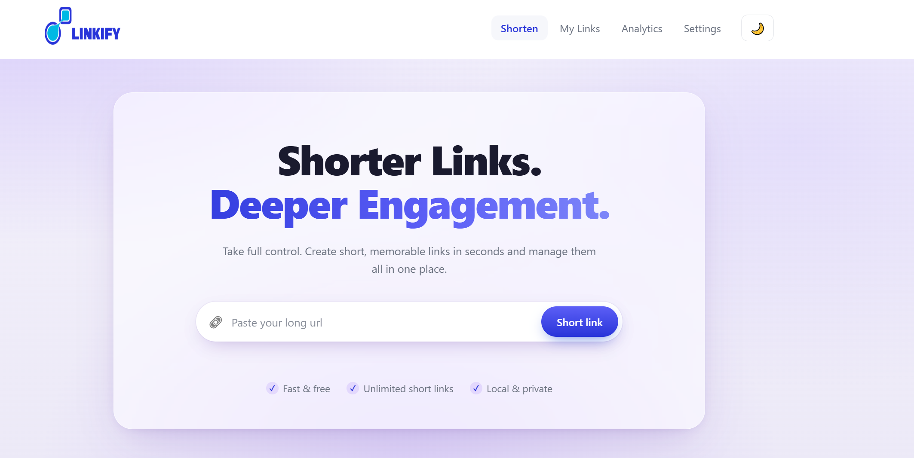
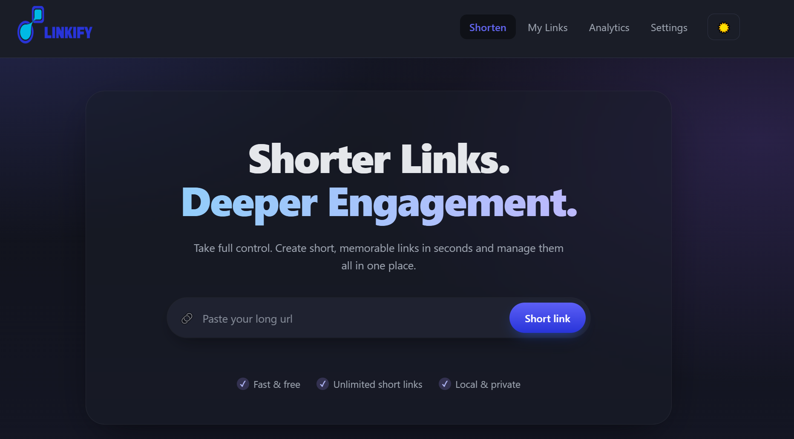

# 🔗 Linkify LinkShortener

**A fast, private, and beautifully designed URL shortener — built with vanilla HTML, CSS, and JavaScript.**

No frameworks. No build step. No backend. Just clean code that runs entirely in your browser.

[Features](#-features) • [Demo](#-demo) • [Getting Started](#-getting-started) • [How It Works](#-how-it-works) • [Project Structure](#-project-structure) • [Roadmap](#-roadmap)


</div>

---

## ✨ Features

### Core
- 🔗 **Shorten any URL** — paste a long link, get a clean 5-character code
- ✅ **Smart validation** — catches malformed URLs, unsupported protocols, and local addresses before saving
- 🎲 **Collision-safe codes** — base62 generation via `crypto.getRandomValues`, checked against existing links
- 💾 **Local persistence** — everything is stored in your browser's `localStorage`
- 🔒 **100% private** — no server, no tracking, no data ever leaves your device
- 📋 **Copy / Open / Delete** — one-click actions on every link
- ⏱️ **Optional expiry** — set links to auto-expire after 7 or 30 days
- 🔍 **Live search & filtering** — find links by URL, code, or time range
- 📊 **Analytics dashboard** — sparklines, area chart, and leaderboard of top performers
- 📦 **Export / Import** — back up your data as JSON or restore from a file
- 🌓 **Dark / light mode** — persisted across sessions
- 📱 **Fully responsive** — desktop, tablet, and mobile nav

### Design
- 🎨 Modern "hero" landing aesthetic with glassmorphism accents
- 📈 Hand-crafted SVG charts — no chart library needed
- 🔔 Toast notifications for every action
- ♿ Keyboard-accessible nav (Escape closes menu)

---

## 🖼️ Demo

> **Live demo:** _Coming soon — deploy to GitHub Pages in one click (see below)._

### Screenshots






| Analytics | Settings |
|:---:|:---:|
| _Add screenshot_ | _Add screenshot_ |

> 💡 **Tip:** Take a few screenshots after opening the app, drop them into a `/screenshots` folder in the repo, and replace the `_Add screenshot_` placeholders with ``.

---

## 🚀 Getting Started

### Prerequisites

You only need a modern web browser. That's it.

### Run locally

```bash
# Clone the repository
git clone https://github.com/YOUR_USERNAME/link-shortener.git
cd link-shortener

# Open in your default browser
open index.html        # macOS
start index.html       # Windows
xdg-open index.html    # Linux
